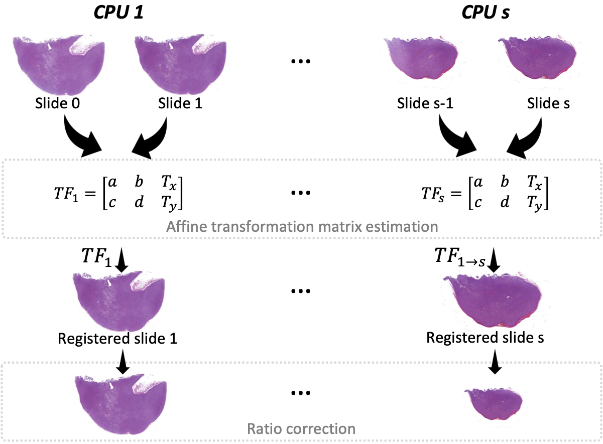

<h1 align="center">
 Efficient 3D reconstruction of Whole Slide Images in Melanoma
</h1>

<p align="center">
 
</p>

<h2 align="center">
Optimization scheme for whole slide images registration
</h2>


## 🛠️ Installation Steps

1. Install anaconda-python (for more details please check https://docs.anaconda.com/anaconda/install/index.html)

2. Clone the repository

```bash
git clone https://github.com/ounissimehdi/WSI-OPT-registration
```

3. Change the working directory

```bash
cd WSI-OPT-registration
```

4. Create a conda environment with all the dependencies from the requirements file, then activate your configured Python environment:

```bash
conda activate YOUR_ENV
```
**Note** that this project is tested on: Windows: 11, MacOS: BigSur and Lunix: Ubuntu 20.04.3 LTS.

🌟 You are all set!


email address : daniel.racoceanu@icm-institute.org
```bash
@misc{Github,
  author={Mehdi Ounissi and Daniel Racoceanu},
  title={Point2Cell: low-shot learning for interactive biomedical image annotation. Instantiation to stain-free phase-contrast microscopy},
  year={2022},
  url={https://github.com/ounissimehdi/Point2Cell},
}
```